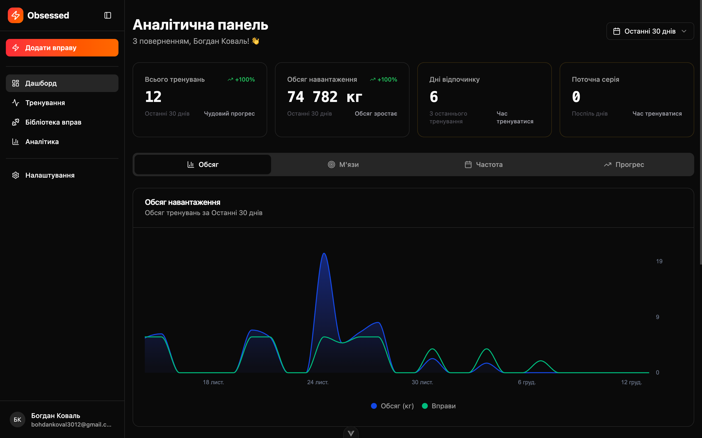
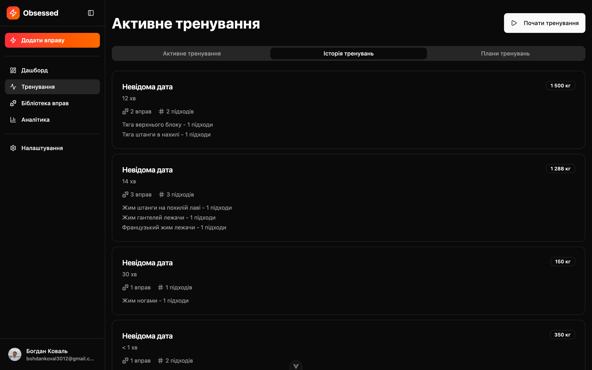
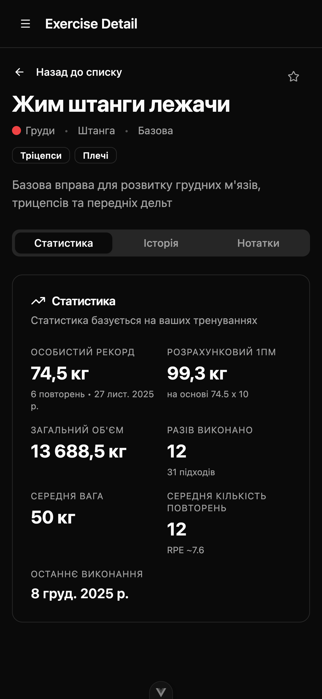
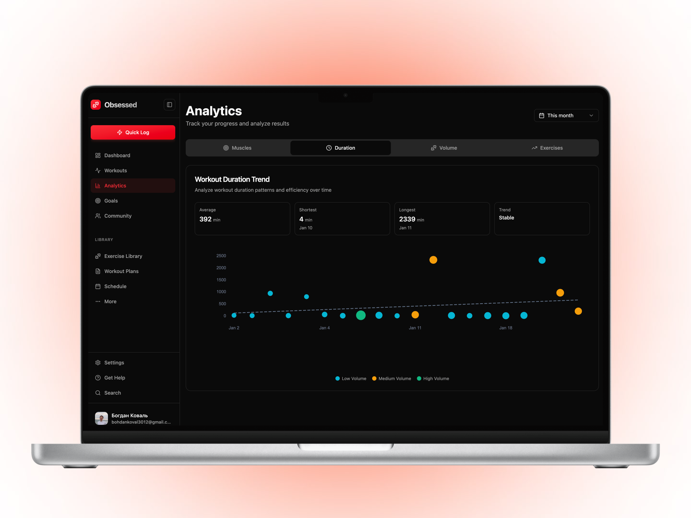
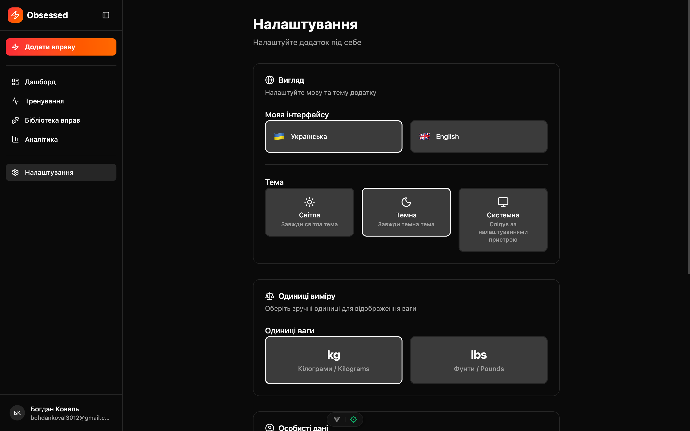
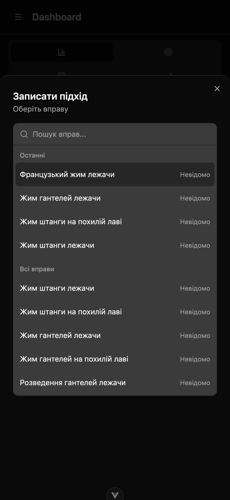
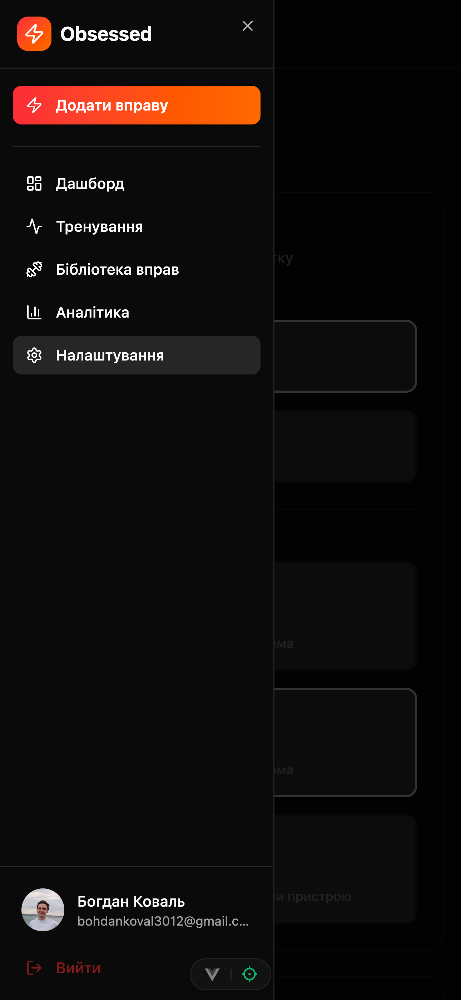

<!-- Last synced: 2025-12-13 -->

# Obsessed

> **Відстежуй чітко. Тренуйся розумно. Залишайся одержимим.** | **Track hard. Train smart. Stay obsessed.**

[](https://vuejs.org/)
[](https://firebase.google.com/)
[](https://nodejs.org/)
[](LICENSE)
[](CONTRIBUTING.md)

[🇬🇧 English](README.md) | [🇺🇦 Українська](README.uk.md)

**Obsessed** — це мобільний застосунок для відстеження тренувань у залі, створений для серйозних атлетів, які вимагають точності, швидкості та глибокого аналізу своїх даних. Побудований на Vue 3, Firebase та Tailwind CSS v4, він надає аналітику в реальному часі, офлайн-режим та двомовну бібліотеку вправ — все оптимізовано для використання в залі.

---

## 🎥 Скріншоти

### Десктопний вигляд

<details open>
<summary>Клікніть щоб розгорнути десктопні скріншоти</summary>

#### Огляд дашборду

*Головна аналітична панель з статистикою в реальному часі, графіками обсягу тренувань, тепловою картою частоти та розподілом по м'язових групах. Бічна панель забезпечує швидку навігацію по всіх розділах додатку.*

#### Історія тренувань

*Повна історія тренувань з фільтрами, функцією пошуку та детальною статистикою для кожної сесії, включаючи тривалість, кількість вправ та загальний обсяг.*

#### Деталі прогресу вправи

*Відстеження окремої вправи з графіками прогресу, персональними рекордами, трендами обсягу та детальною історією підход за підходом.*

#### Аналітична панель з графіками

*Розширена аналітика з кількома типами графіків: тижневий розподіл обсягу, кругова діаграма м'язових груп, теплова карта частоти тренувань та порівняння прогресу за періодами.*

#### Сторінка налаштувань

*Налаштування користувача, включаючи профіль, вибір мови (українська/англійська), конвертацію одиниць ваги (кг/фунти) та управління акаунтом.*

</details>

### Мобільний вигляд

<details>
<summary>Клікніть щоб розгорнути мобільні скріншоти</summary>

#### Швидкий вибір вправи

*Мобільно-оптимізований інтерфейс швидкого логування з пошуком вправ, секцією останніх вправ та повною бібліотекою вправ. Розроблено для зручного керування пальцями з мінімальними цілями дотику 44x44px.*

#### Активне відстеження тренування

*Екран відстеження тренування в реальному часі з таймером, списком вправ, інтерфейсом логування підходів та швидкими діями. Оптимізовано для використання в залі з великими контрастними кнопками.*

#### Мобільна навігація

*Нижня навігаційна панель з вкладками Головна, Тренування, Аналітика та Налаштування. Чистий мінімалістичний дизайн для керування однією рукою.*

</details>

---

## 🏋️ Чому Obsessed?

Більшість застосунків для відстеження тренувань переповнені зайвим, повільні або не мають глибини, яка потрібна серйозним атлетам. **Obsessed** вирішує це:

- **⚡ Блискавичне логування:** Швидкий лист для запису сетів за лічені секунди, навіть з мокрими руками
- **📊 Аналітика в реальному часі:** Спостерігайте, як ваша статистика оновлюється миттєво під час логування тренувань
- **🌐 Двомовність з першого дня:** Повна підтримка української та англійської мов, включно з 68 вправами обома мовами
- **📴 Офлайн-режим:** Записуйте тренування без інтернету; синхронізація відбувається автоматично при підключенні
- **🎯 Мобільно-орієнтований UX:** Створено для зручного керування пальцями з мінімальними цілями дотику 44x44px (WCAG 2.1)
- **🧠 Розумна аналітика:** Автоматичне відстеження персональних рекордів, аналіз частоти тренувань та балансу м'язових груп
- **⚙️ Гнучкість одиниць:** Перемикайтеся між кг та фунтами з миттєвою конвертацією по всьому застосунку

Чи ви пауерліфтер, який відстежує ПР, бодібілдер, що контролює об'єм, чи звичайний відвідувач зали, який будує послідовність — Obsessed дає вам інструменти для зростання.

---

## ✨ Основні функції

### 🏃 Відстеження тренувань
- **Швидкий лист логування:** Інтерфейс-оверлей для швидкого запису сетів без виходу з перегляду тренування
- **Живий таймер:** Інтегрований таймер відпочинку з налаштовуваними інтервалами
- **Плани тренувань:** Створюйте власні шаблони тренувань з попередньо визначеними вправами
- **Історія тренувань:** Переглядайте минулі тренування з можливістю пошуку та фільтрації
- **Бібліотека вправ:** 68 двомовних вправ, що охоплюють усі основні м'язові групи (груди, спина, плечі, руки, ноги, кор)

### 📈 Аналітика та інсайти
- **Панель в реальному часі:** Бачте загальну кількість тренувань, піднятий об'єм, частоту тренувань та активні серії з першого погляду
- **Персональні рекорди:** Автоматичне відстеження 1ПМ, максимального об'єму та найважчих сетів по кожній вправі
- **Тренди тренувань:** Візуальні графіки частоти тренувань, прогресії об'єму та патернів днів відпочинку
- **Баланс м'язових груп:** Аналізуйте, які м'язові групи тренуються, та виявляйте дисбаланс
- **Історія вправ:** Детальні логи по кожній вправі з відстеженням прогресу

### 🌍 Інтернаціоналізація (i18n)
- **Повна двомовна підтримка:** Українська (за замовчуванням) та англійська з плавним перемиканням
- **Локалізоване форматування чисел:** Правильні роздільники десяткових/тисяч для кожної локалі
- **Простори імен перекладів:** Організовані ключі перекладів для зручності підтримки
- **Синхронізація налаштувань:** Вибір мови зберігається на всіх пристроях через Firestore

### 🔧 Технічні особливості
- **Офлайн-First архітектура:** Шар персистентності Firebase забезпечує безперервне відстеження
- **Розумна конвертація одиниць:** Всі ваги зберігаються в кг, відображаються в обраній користувачем одиниці (кг/фунти)
- **Реактивне управління станом:** Сховища Pinia з Vue 3 Composition API для миттєвих оновлень UI
- **Mobile-first дизайн:** Адаптивні макети оптимізовані для мобільних в'юпортів 375px-428px
- **Доступність на першому місці:** ARIA-мітки, семантичний HTML, навігація з клавіатури, відповідність WCAG 2.1

---

## 🛠️ Технологічний стек

### Frontend
- **[Vue.js 3.5.25](https://vuejs.org/)** - Прогресивний JavaScript-фреймворк з Composition API
- **[Pinia 3.0.4](https://pinia.vuejs.org/)** - Інтуїтивне управління станом
- **[Vue Router 4.6.3](https://router.vuejs.org/)** - Офіційний роутер з навігаційними гардами
- **[vue-i18n 9.14.5](https://vue-i18n.intlify.dev/)** - Фреймворк інтернаціоналізації

### Backend та база даних
- **[Firebase 12.6.0](https://firebase.google.com/)** - Модульний SDK з tree-shaking
  - **Firestore:** NoSQL база даних в реальному часі
  - **Authentication:** Email/пароль + Google OAuth
  - **Офлайн-персистентність:** Локальне кешування для офлайн-UX

### UI та стилізація
- **[Tailwind CSS 4.1.17](https://tailwindcss.com/)** - Utility-first CSS фреймворк (v4 з сучасним синтаксисом)
- **[shadcn-vue](https://www.shadcn-vue.com/)** - Headless UI компоненти на базі reka-ui
- **[reka-ui 2.6.0](https://reka-ui.com/)** - Vue порт Radix UI примітивів
- **[lucide-vue-next 0.555.0](https://lucide.dev/)** - Красива бібліотека іконок
- **[vue-sonner 2.0.9](https://vue-sonner.vercel.app/)** - Toast-сповіщення

### Візуалізація даних
- **[@unovis/vue 1.6.2](https://unovis.dev/)** - Модульна бібліотека графіків для аналітики

### Обробка форм та валідація
- **[vee-validate 4.15.1](https://vee-validate.logaretm.com/)** - Фреймворк валідації форм
- **[@vee-validate/zod 4.15.1](https://vee-validate.logaretm.com/v4/integrations/zod)** - Інтеграція Zod для схем валідації
- **[zod 3.25.76](https://zod.dev/)** - TypeScript-first валідація схем

### Інструменти розробки
- **[Vite 7.2.4](https://vite.dev/)** - Інструментарій фронтенду нового покоління
- **[Vitest 4.0.14](https://vitest.dev/)** - Швидкий фреймворк юніт-тестування
- **[@vue/test-utils 2.4.6](https://test-utils.vuejs.org/)** - Офіційні утиліти тестування Vue
- **[ESLint 9.39.1](https://eslint.org/)** - Лінтинг з flat config + плагін Vue
- **[Prettier 3.6.2](https://prettier.io/)** - Форматування коду
- **[Vue DevTools 8.0.5](https://devtools.vuejs.org/)** - Інтеграція браузерного розширення

---

## 📋 Передумови

Перед початком переконайтеся, що у вас встановлено:

- **Node.js:** `^20.19.0` АБО `>=22.12.0` (рекомендується LTS)
- **npm:** `10.9.4` або вище (постачається з Node.js)
- **Firebase проєкт:** Створіть його на [Firebase Console](https://console.firebase.google.com/)
  - Увімкніть **Firestore Database**
  - Увімкніть **Authentication** (Email/Password + Google)
  - Увімкніть **Офлайн-персистентність** в налаштуваннях Firestore

Опціонально, але рекомендовано:
- **Git:** Для контролю версій
- **VS Code:** З розширенням Vue (Official)

---

## 🚀 Встановлення та налаштування

### 1. Клонуйте репозиторій

```bash
git clone https://github.com/bohdan-kov/Obsessed.git
cd obsessed
```

### 2. Встановіть залежності

```bash
npm install
```

Це встановить усі залежності для продакшену та розробки, перелічені в `package.json`.

### 3. Налаштуйте змінні середовища

Створіть файл `.env.local` в корені проєкту:

```bash
# Конфігурація Firebase
VITE_FIREBASE_API_KEY=ваш_api_ключ
VITE_FIREBASE_AUTH_DOMAIN=ваш_project_id.firebaseapp.com
VITE_FIREBASE_PROJECT_ID=ваш_project_id
VITE_FIREBASE_STORAGE_BUCKET=ваш_project_id.appspot.com
VITE_FIREBASE_MESSAGING_SENDER_ID=ваш_sender_id
VITE_FIREBASE_APP_ID=ваш_app_id
```

**Де знайти ці значення:**
1. Перейдіть до [Firebase Console](https://console.firebase.google.com/)
2. Виберіть свій проєкт
3. Натисніть іконку шестерні → Налаштування проєкту
4. Прокрутіть до "Ваші додатки" → Веб-додаток → Налаштування SDK та конфігурація
5. Скопіюйте значення конфігурації

**Важливо:**
- Усі змінні середовища Firebase **обов'язкові**. Додаток валідує їх під час запуску та видає чіткі помилки, якщо якісь відсутні.
- Ніколи не коміттьте `.env.local` в систему контролю версій (він вже в `.gitignore`)

### 4. Налаштуйте Firestore базу даних

#### 4a. Увімкніть Firestore
1. В Firebase Console перейдіть до **Firestore Database**
2. Натисніть **Створити базу даних**
3. Виберіть **Почати в тестовому режимі** (правила безпеки додамо пізніше)
4. Виберіть бажаний регіон

#### 4b. Наповніть бібліотеку вправ

Застосунок постачається з комплексною бібліотекою з 68 двомовних вправ. Наповніть Firestore:

```bash
npm run seed:exercises
```

Це заповнить вашу базу даних вправами:
- Груди: 9 вправ
- Спина: 10 вправ
- Плечі: 8 вправ
- Біцепс: 7 вправ
- Тріцепс: 6 вправ
- Ноги: 14 вправ (квадрицепси, біцепси стегна, сідниці)
- Литки: 3 вправи
- Кор: 8 вправ

**Примітка:** Цей скрипт ідемпотентний — безпечно запускати кілька разів. Він пропускає вправи, які вже існують.

### 5. Запустіть сервер розробки

```bash
npm run dev
```

Застосунок буде доступний за адресою `http://localhost:5173` (або наступний вільний порт).

### 6. Створіть свій перший акаунт

1. Перейдіть до `http://localhost:5173`
2. Натисніть **Реєстрація** та створіть акаунт через email/пароль або Google OAuth
3. Підтвердіть свою електронну пошту, якщо використовуєте email/пароль
4. Вас буде перенаправлено на панель

**Порада для першого налаштування:** Створіть план тренувань, додайте вправи та залогуйте своє перше тренування, щоб побачити, як аналітика заповнюється в реальному часі!

---

## 📜 Доступні скрипти

| Скрипт | Команда | Опис |
|--------|---------|------|
| **Розробка** | `npm run dev` | Запускає dev-сервер Vite з гарячою перезавантажкою на `http://localhost:5173` |
| **Збірка** | `npm run build` | Компілює та мініфікує для продакшену в папку `dist/` |
| **Перегляд** | `npm run preview` | Переглядає продакшн-збірку локально перед деплоєм |
| **Лінтинг** | `npm run lint` | Запускає ESLint з авто-виправленням та кешуванням |
| **Форматування** | `npm run format` | Форматує код за допомогою Prettier (експериментальний CLI) |
| **Тести** | `npm run test` | Запускає Vitest в режимі watch з UI |
| **Тести (CI)** | `npm run test:run` | Запускає тести один раз без режиму watch (для CI/CD пайплайнів) |
| **Наповнення тренувань** | `npm run seed:workouts` | Додає зразкові дані тренувань до Firestore (розробка) |
| **Видалення тренувань** | `npm run seed:workouts:remove` | Видаляє зразкові дані тренувань з Firestore |

**Корисні поради:**
- Використовуйте `npm run dev` під час розробки для миттєвої гарячої перезавантажки
- Запускайте `npm run lint` перед комітом, щоб виявити проблеми заздалегідь
- Використовуйте `npm run test` для відстеження тестів під час їх написання
- Завжди запускайте `npm run build` перед деплоєм на продакшн

---

## 📁 Структура проєкту

```
obsessed/
├── public/                     # Статичні ресурси (обслуговуються як є)
├── scripts/                    # Утилітні скрипти
│   ├── seedExercises.js        # Наповнення бібліотеки вправ до Firestore
│   └── seedWorkouts.js         # Наповнення зразкових тренувань (dev/testing)
├── src/
│   ├── assets/                 # Зображення, шрифти, статичні файли
│   ├── components/             # Компоненти Vue для повторного використання
│   │   ├── ui/                 # Базові компоненти shadcn-vue
│   │   │   ├── button/         # Компонент кнопки
│   │   │   ├── card/           # Компонент картки
│   │   │   ├── input/          # Компонент вводу
│   │   │   ├── sheet/          # Компонент Sheet (drawer)
│   │   │   ├── toast/          # Система toast-сповіщень
│   │   │   └── ...             # Інші UI примітиви
│   │   ├── QuickLogButton.vue  # Плаваюча кнопка швидкого логування
│   │   └── QuickLogSheet.vue   # Оверлей швидкого логування тренувань
│   ├── composables/            # Функції композиції для повторного використання
│   │   ├── useAuth.js          # Утиліти автентифікації
│   │   ├── useErrorHandler.js  # Централізована обробка помилок
│   │   ├── useFirestore.js     # Допоміжні функції Firestore
│   │   ├── useLocale.js        # i18n та управління локалями
│   │   └── useUnits.js         # Конвертація одиниць ваги (кг/фунти)
│   ├── constants/              # Константи застосунку
│   │   └── config.js           # Всі магічні числа та конфігурація
│   ├── firebase/               # Конфігурація та сервіси Firebase
│   │   ├── config.js           # Ініціалізація та валідація Firebase
│   │   ├── auth.js             # Шар сервісу автентифікації
│   │   └── firestore.js        # Шар сервісу Firestore
│   ├── i18n/                   # Інтернаціоналізація
│   │   ├── locales/
│   │   │   ├── en/             # Англійські переклади
│   │   │   │   ├── common.json
│   │   │   │   ├── dashboard.json
│   │   │   │   ├── workout.json
│   │   │   │   └── ...
│   │   │   ├── uk/             # Українські переклади (за замовчуванням)
│   │   │   │   ├── common.json
│   │   │   │   ├── dashboard.json
│   │   │   │   └── ...
│   │   └── index.js            # Конфігурація i18n
│   ├── layouts/                # Компоненти лейаутів
│   │   ├── AppLayout.vue       # Основний лейаут застосунку з сайдбаром
│   │   ├── AppSidebar.vue      # Десктопна навігація сайдбару
│   │   └── MobileNav.vue       # Мобільна навігація знизу
│   ├── lib/                    # Утилітні бібліотеки
│   │   └── utils.js            # Допоміжні функції (cn, clsx, тощо)
│   ├── pages/                  # Сторінки маршрутів
│   │   ├── analytics/          # Сторінка аналітики
│   │   ├── auth/               # Сторінки авторизації (login, register, verify-email)
│   │   ├── dashboard/          # Сторінка панелі
│   │   │   └── components/     # Компоненти специфічні для панелі
│   │   ├── settings/           # Сторінка налаштувань
│   │   └── workouts/           # Сторінка тренувань
│   ├── router/                 # Конфігурація Vue Router
│   │   └── index.js            # Визначення маршрутів та навігаційні гарди
│   ├── stores/                 # Сховища Pinia (управління станом)
│   │   ├── analyticsStore.js   # Обчислення аналітики
│   │   ├── authStore.js        # Стан автентифікації
│   │   ├── exerciseStore.js    # Стан бібліотеки вправ
│   │   ├── userStore.js        # Стан профілю користувача
│   │   └── workoutStore.js     # Стан даних тренувань
│   ├── styles/                 # Глобальні стилі
│   │   └── globals.css         # Імпорти Tailwind та власний CSS
│   ├── App.vue                 # Кореневий компонент Vue
│   └── main.js                 # Точка входу застосунку
├── .env.local                  # Змінні середовища (створіть це, не комітиться)
├── .eslintrc.js                # Конфігурація ESLint (flat config)
├── .gitignore                  # Правила ігнорування Git
├── .prettierrc.json            # Конфігурація Prettier
├── CLAUDE.md                   # Документація проєкту для Claude Code
├── components.json             # Конфігурація shadcn-vue
├── index.html                  # HTML точка входу
├── package.json                # Залежності та скрипти
├── postcss.config.js           # Конфігурація PostCSS
├── tailwind.config.js          # Конфігурація Tailwind CSS
├── vite.config.js              # Конфігурація Vite
├── vitest.config.js            # Конфігурація Vitest
├── vitest.setup.js             # Глобальне налаштування Vitest
└── README.uk.md                # Цей файл
```

---

## 🏗️ Огляд архітектури

### Трирівнева архітектура

Obsessed дотримується чистої трирівневої архітектури для інтеграції Firebase:

```
┌─────────────────────────────────────────┐
│          Шар компонентів (UI)           │
│  Vue компоненти споживають Pinia stores │
│  Використовують storeToRefs() для       │
│  реактивності                           │
└──────────────────┬──────────────────────┘
                   │
┌──────────────────▼──────────────────────┐
│   Шар сховищ (управління станом)       │
│  Pinia stores з Setup Store синтаксисом │
│  - authStore: стан автентифікації       │
│  - workoutStore: дані тренувань         │
│  - analyticsStore: обчислена аналітика  │
│  - exerciseStore: бібліотека вправ      │
│  - userStore: профіль користувача       │
└──────────────────┬──────────────────────┘
                   │
┌──────────────────▼──────────────────────┐
│      Шар сервісів (Firebase SDK)       │
│  auth.js: функції автентифікації        │
│  firestore.js: утиліти бази даних       │
└──────────────────┬──────────────────────┘
                   │
┌──────────────────▼──────────────────────┐
│   Шар конфігурації (Firebase Init)     │
│  config.js: валідує змінні середовища   │
│  Експортує ініціалізований Firebase app │
└─────────────────────────────────────────┘
```

### Стратегія управління станом

**Pinia Setup Stores (синтаксис функцій):**
```javascript
export const useMyStore = defineStore('myStore', () => {
  // Стан (refs)
  const data = ref([])
  const loading = ref(false)

  // Геттери (computed)
  const filteredData = computed(() =>
    data.value.filter(item => item.active)
  )

  // Дії (функції)
  async function fetchData() {
    loading.value = true
    try {
      data.value = await fetchCollection('collectionName')
    } catch (error) {
      handleError(error, 'Не вдалося отримати дані')
    } finally {
      loading.value = false
    }
  }

  return { data, loading, filteredData, fetchData }
})
```

**Залежності сховищ:**
- `analyticsStore` залежить від даних `workoutStore` для реактивних обчислень
- Усі сховища можуть звертатися до `authStore` для UID поточного користувача
- Використовуйте `storeToRefs()` при доступі до реактивного стану в компонентах

### Потік маршрутизації та автентифікації

**Мета-поля маршрутів:**
- `requiresAuth: true` - Потрібна авторизація
- `requiresGuest: true` - Потрібен вихід з системи (сторінки login/register)
- `requiresVerification: true` - Потрібна підтверджена електронна пошта

**Логіка навігаційних гардів:**
1. Чекати, поки `authStore.initializing` стане false (запобігає race conditions)
2. Перевірити вимоги мета маршруту
3. Перенаправити на login, якщо потрібна авторизація, але користувач не автентифікований
4. Перенаправити на dashboard, якщо маршрут для гостей, але користувач автентифікований
5. Перенаправити на verify-email, якщо потрібна верифікація, але email не підтверджений

---

## 🎨 Технічні особливості

### 1. Офлайн-відстеження тренувань
Шар персистентності Firebase Firestore забезпечує безперервне логування тренувань навіть без інтернету. Дані синхронізуються автоматично при відновленні з'єднання.

```javascript
// Приклад: персистентність Firestore увімкнена в config.js
enableIndexedDbPersistence(db).catch((err) => {
  if (err.code === 'failed-precondition') {
    console.warn('Відкрито кілька вкладок, персистентність увімкнена лише в першій')
  } else if (err.code === 'unimplemented') {
    console.warn('Браузер не підтримує персистентність')
  }
})
```

### 2. Аналітика в реальному часі з реактивними обчисленнями
Аналітика оновлюється миттєво під час логування тренувань завдяки реактивним computed властивостям Pinia.

```javascript
// Приклад: analyticsStore обчислює статистику з workoutStore
const totalWorkouts = computed(() => workoutStore.workouts.length)
const totalVolume = computed(() =>
  workoutStore.workouts.reduce((sum, w) => sum + w.totalVolume, 0)
)
```

### 3. Двомовна бібліотека вправ
68 вправ з повними українськими та англійськими перекладами. Композабл `useLocale` обробляє перемикання плавно.

```javascript
// Приклад: назви вправ враховують локаль
const exerciseName = computed(() =>
  currentLocale.value === 'uk' ? exercise.name.uk : exercise.name.en
)
```

### 4. Розумна конвертація одиниць (кг ↔ фунти)
Усі ваги зберігаються в кг у Firestore. Композабл `useUnits` обробляє конвертацію для відображення.

```javascript
// Приклад: відображення ваги в обраній користувачем одиниці
import { useUnits } from '@/composables/useUnits'
const { formatWeight, toStorageUnit } = useUnits()

// Відображення: 100 кг → "220.46 фунтів", якщо користувач обирає фунти
const displayWeight = formatWeight(100)

// Збереження: 220 фунтів → 100 кг для Firestore
const storageWeight = toStorageUnit(220)
```

### 5. Мобільно-оптимізований UX
Побудовано mobile-first з взаємодіями, зручними для пальців:
- Мінімальні цілі дотику 44x44px (WCAG 2.1)
- Великі, контрастні кнопки для освітлення в залі
- Оверлей швидкого логування для швидкого запису сетів
- Адаптивні breakpoints: `375px → 428px → 768px → 1024px`

---

## 🧪 Тестування

### Запуск тестів

```bash
# Режим watch (рекомендовано під час розробки)
npm run test

# Режим CI (запускається один раз)
npm run test:run
```

### Структура тестів

```
src/
├── stores/
│   └── __tests__/
│       ├── authStore.spec.js
│       ├── workoutStore.spec.js
│       └── analyticsStore.spec.js
├── pages/
│   └── dashboard/
│       └── components/
│           └── __tests__/
│               └── StatCard.spec.js
└── components/
    └── __tests__/
        └── QuickLogSheet.spec.js
```

### Патерни тестування

**1. Мокуйте Firebase перед імпортами:**
```javascript
import { vi, describe, it, expect, beforeEach } from 'vitest'

// ПЕРЕД імпортом сховищ
vi.mock('@/firebase/firestore', () => ({
  fetchCollection: vi.fn(),
  createDocument: vi.fn(),
  updateDocument: vi.fn(),
}))

import { useWorkoutStore } from '@/stores/workoutStore'
```

**2. Правильно встановлюйте стан авторизації:**
```javascript
import { useAuthStore } from '@/stores/authStore'
import { onAuthChange } from '@/firebase/auth'

function setAuthUser(userId = 'test-user-id') {
  onAuthChange.mockImplementation((callback) => {
    callback(userId ? { uid: userId, email: 'test@test.com' } : null)
    return vi.fn() // функція відписки
  })
  const authStore = useAuthStore()
  authStore.initAuth()
}
```

**3. Тестуйте компоненти з Pinia:**
```javascript
import { mount } from '@vue/test-utils'
import { createTestingPinia } from '@pinia/testing'

const wrapper = mount(MyComponent, {
  global: {
    plugins: [
      createTestingPinia({
        initialState: {
          workoutStore: { workouts: [] }
        }
      })
    ]
  }
})
```

**Глобальне налаштування тестів:**
- `vitest.setup.js` мокує `vue-i18n`, `useUnits` та `useLocale` глобально
- `$t('key')` повертає сам ключ для легких перевірок
- Не потрібно мокувати i18n в окремих тестових файлах

---

## 📐 Стиль коду та стандарти

### Vue 3 Composition API
- **ЗАВЖДИ** використовуйте синтаксис `<script setup>` (Options API заборонений)
- Використовуйте `ref()` для реактивних примітивів та об'єктів, що потребують глибокої реактивності
- Використовуйте `computed()` для похідного стану, що залежить від інших реактивних значень
- Використовуйте `watch()` та `watchEffect()` для побічних ефектів
- Деструктуруйте props за допомогою `defineProps()` та емітуйте події з `defineEmits()`

### Управління станом Pinia
- **ЗАВЖДИ** використовуйте синтаксис Setup Store: `defineStore(() => { ... })`
- НІКОЛИ не використовуйте синтаксис Options Store
- Структуруйте сховища: стан (refs), геттери (computed), дії (функції)
- Використовуйте `storeToRefs()` в компонентах для збереження реактивності при деструктуризації

### Tailwind v4 та Mobile-First UI
- Будуйте MOBILE-FIRST: проєктуйте для взаємодій, зручних для пальців
- Мінімальний розмір цілі дотику: 44x44px (`min-h-11 min-w-11`)
- Використовуйте адаптивні breakpoints прогресивно: `sm:`, `md:`, `lg:`, `xl:`
- Використовуйте компоненти `shadcn-vue` як UI примітиви, налаштовуйте за допомогою Tailwind

### Інтернаціоналізація
- Весь текст UI ПОВИНЕН використовувати переклади i18n (ніяких жорстко закодованих рядків)
- Ключі перекладів слідують патерну простору імен: `namespace.section.key`
- Оновлюйте ОБИДВІ папки локалей `uk/` та `en/` при додаванні функцій

### Форматування коду
- Prettier обробляє все форматування (див. `.prettierrc.json`)
- ESLint забезпечує кращі практики Vue (flat config з `eslint-plugin-vue`)
- Запускайте `npm run format` перед комітом

---

## 🖥️ Налаштування браузера та IDE

### Рекомендована IDE
**[VS Code](https://code.visualstudio.com/)** з наступними розширеннями:
- **[Vue (Official)](https://marketplace.visualstudio.com/items?itemName=Vue.volar)** - Підтримка мови Vue (вимкніть Vetur, якщо встановлено)
- **[ESLint](https://marketplace.visualstudio.com/items?itemName=dbaeumer.vscode-eslint)** - Лінтинг в реальному часі
- **[Prettier](https://marketplace.visualstudio.com/items?itemName=esbenp.prettier-vscode)** - Форматування коду
- **[Tailwind CSS IntelliSense](https://marketplace.visualstudio.com/items?itemName=bradlc.vscode-tailwindcss)** - Автодоповнення Tailwind

### Рекомендоване налаштування браузера

**Браузери на основі Chromium (Chrome, Edge, Brave):**
- [Vue.js devtools](https://chromewebstore.google.com/detail/vuejs-devtools/nhdogjmejiglipccpnnnanhbledajbpd)
- [Увімкніть Custom Object Formatter в Chrome DevTools](http://bit.ly/object-formatters) для кращого логування в консолі

**Firefox:**
- [Vue.js devtools](https://addons.mozilla.org/en-US/firefox/addon/vue-js-devtools/)
- [Увімкніть Custom Object Formatter в Firefox DevTools](https://fxdx.dev/firefox-devtools-custom-object-formatters/)

---

## 🤝 Внесок у проєкт

Ми вітаємо внески! Будь то виправлення помилок, нові функції чи покращення документації — ваша допомога цінується.

### Як зробити внесок

1. **Зробіть форк репозиторію**
2. **Створіть гілку функції:** `git checkout -b feature/amazing-feature`
3. **Внесіть зміни** та дотримуйтесь вищенаведених рекомендацій щодо стилю коду
4. **Запустіть тести:** `npm run test:run`
5. **Перевірте свій код:** `npm run lint`
6. **Закомітьте зміни:** `git commit -m 'feat: Add amazing feature'`
7. **Надішліть до своєї гілки:** `git push origin feature/amazing-feature`
8. **Відкрийте Pull Request** з чітким описом ваших змін

### Рекомендації щодо внеску
- Дотримуйтесь патернів Vue 3 Composition API та Pinia Setup Store
- Оновлюйте як англійські, так і українські переклади для змін UI
- Додавайте тести для нових функцій або виправлень помилок
- Переконайтеся, що всі тести проходять перед відправкою PR
- Робіть коміти атомарними та використовуйте формат [Conventional Commits](https://www.conventionalcommits.org/)

### Повідомлення про помилки
Знайшли помилку? Будь ласка, відкрийте issue з:
- Чітким описом проблеми
- Кроками для відтворення
- Очікуваною та фактичною поведінкою
- Скріншотами (якщо застосовно)
- Інформацією про браузер/пристрій

---

## 🚢 Деплой

### Передумови для продакшену
- Firebase проєкт з продакшн Firestore базою даних
- Налаштовані змінні середовища для продакшену
- Налаштовані правила безпеки в Firestore

### Збірка для продакшену

```bash
npm run build
```

Це створює оптимізовану продакшн-збірку в папці `dist/`.

### Локальний перегляд продакшн-збірки

```bash
npm run preview
```

### Варіанти деплою

#### Варіант 1: Firebase Hosting
```bash
# Встановіть Firebase CLI
npm install -g firebase-tools

# Увійдіть до Firebase
firebase login

# Ініціалізуйте хостинг
firebase init hosting

# Задеплойте
firebase deploy --only hosting
```

#### Варіант 2: Vercel
1. Встановіть Vercel CLI: `npm install -g vercel`
2. Запустіть `vercel` в корені проєкту
3. Слідуйте підказкам для деплою

#### Варіант 3: Netlify
1. Надішліть свій код на GitHub
2. Підключіть репозиторій до Netlify
3. Встановіть команду збірки: `npm run build`
4. Встановіть директорію публікації: `dist`
5. Додайте змінні середовища в панелі Netlify

**Важливо:** Переконайтеся, що всі змінні середовища `VITE_FIREBASE_*` налаштовані в панелі вашої платформи деплою.

---

## 🛠️ Усунення несправностей

### Поширені проблеми

#### Проблема: "Валідація конфігурації Firebase не вдалася"
**Рішення:** Переконайтеся, що всі змінні `VITE_FIREBASE_*` встановлені в `.env.local`. Застосунок валідує їх при запуску та видасть чіткі помилки, вказуючи, які відсутні.

#### Проблема: Тести падають з "Не можна отримати доступ до 'X' перед ініціалізацією"
**Рішення:** Переконайтеся, що сервіси Firebase замоковані ПЕРЕД імпортом сховищ:
```javascript
vi.mock('@/firebase/firestore', () => ({ ... }))
import { useWorkoutStore } from '@/stores/workoutStore' // Імпорт ПІСЛЯ мока
```

#### Проблема: "Нескінченний цикл навігаційного гарду маршруту"
**Рішення:** Переконайтеся, що `authStore.initAuth()` викликається в `App.vue` onMounted. Роутер чекає, поки `authStore.initializing` стане false перед виконанням гардів.

#### Проблема: Ваги не конвертуються між кг/фунтами
**Рішення:** Перевірте, чи імпортовано та використовується композабл `useUnits`. Зберігання завжди в кг; конвертація відбувається під час відображення.

#### Проблема: Переклади i18n показуються як "namespace.section.key"
**Рішення:** Переконайтеся, що обидві папки локалей `uk/` та `en/` мають ключ перекладу. Перевірте консоль браузера на попередження про відсутні переклади (лише в dev режимі).

#### Проблема: "Відкрито кілька вкладок, персистентність увімкнена лише в першій"
**Рішення:** Це попередження, а не помилка. Офлайн-персистентність Firebase працює лише в одній вкладці одночасно. Закрийте інші вкладки або ігноруйте попередження.

---

## 🗺️ Дорожня карта

### Версія 1.0 (Поточна)
- ✅ Відстеження тренувань зі швидким листом логування
- ✅ Панель аналітики в реальному часі
- ✅ Двомовна бібліотека вправ (68 вправ)
- ✅ Офлайн-first архітектура
- ✅ Конвертація одиниць (кг/фунти)
- ✅ Відстеження персональних рекордів

### Версія 1.1 (Наступний реліз)
- ⏳ Шаблони планів тренувань
- ⏳ Створення власних вправ
- ⏳ Експорт даних тренувань (CSV, JSON)
- ⏳ Підтримка темного режиму
- ⏳ Підтримка Progressive Web App (PWA)

### Версія 2.0 (Майбутнє)
- 🔮 Соціальні функції (ділитися тренуваннями, слідкувати за друзями)
- 🔮 AI-рекомендації тренувань
- 🔮 Відео-демонстрації вправ
- 🔮 Розширена аналітика (відстеження періодизації, виявлення розвантаження)
- 🔮 Інтеграція з фітнес-трекерами (Apple Health, Google Fit)

**Маєте запит на функцію?** Відкрийте issue з міткою `enhancement`!

---

## 📄 Ліцензія

Цей проєкт ліцензовано під **ліцензією MIT**.

```
Ліцензія MIT

Copyright (c) 2025 Контриб'ютори Obsessed

Дозволяється безкоштовно будь-якій особі, яка отримує копію
цього програмного забезпечення та супутньої документації (далі "Програмне забезпечення"),
використовувати Програмне забезпечення без обмежень, включаючи, але не обмежуючись,
права на використання, копіювання, зміну, об'єднання, публікацію, розповсюдження,
субліцензування та/або продаж копій Програмного забезпечення, а також дозволяти
особам, яким надається Програмне забезпечення, робити це, за умови дотримання
наступних умов:

Вищезазначене повідомлення про авторські права та це повідомлення про дозвіл
повинні бути включені у всі копії або суттєві частини Програмного забезпечення.

ПРОГРАМНЕ ЗАБЕЗПЕЧЕННЯ НАДАЄТЬСЯ "ЯК Є", БЕЗ БУДЬ-ЯКИХ ГАРАНТІЙ, ЯВНИХ АБО
НЕЯВНИХ, ВКЛЮЧАЮЧИ, АЛЕ НЕ ОБМЕЖУЮЧИСЬ, ГАРАНТІЇ ПРИДАТНОСТІ ДЛЯ ПРОДАЖУ,
ПРИДАТНОСТІ ДЛЯ ПЕВНОЇ МЕТИ ТА НЕНАРУШЕННЯ ПРАВ. У ЖОДНОМУ РАЗІ АВТОРИ АБО
ВЛАСНИКИ АВТОРСЬКИХ ПРАВ НЕ НЕСУТЬ ВІДПОВІДАЛЬНОСТІ ЗА БУДЬ-ЯКІ ПРЕТЕНЗІЇ,
ЗБИТКИ АБО ІНШУ ВІДПОВІДАЛЬНІСТЬ, ЧИ ТО В РЕЗУЛЬТАТІ КОНТРАКТНИХ ДІЙ, ДЕЛІКТУ
АБО ІНШИМ ЧИНОМ, ЩО ВИНИКАЮТЬ З АБО У ЗВ'ЯЗКУ З ПРОГРАМНИМ ЗАБЕЗПЕЧЕННЯМ АБО
ВИКОРИСТАННЯМ ЧИ ІНШИМИ ДІЯМИ З ПРОГРАМНИМ ЗАБЕЗПЕЧЕННЯМ.
```

Дивіться файл [LICENSE](LICENSE) для повного тексту.

---

## 🙏 Подяки

Створено з пристрастю розробниками, які розуміють важку працю. Особлива подяка:

- **[Команда Vue.js](https://vuejs.org/)** - За створення дивовижного фреймворку
- **[Команда Firebase](https://firebase.google.com/)** - За найкращу базу даних реального часу та авторизацію
- **[shadcn](https://ui.shadcn.com/)** - За красиву систему headless-компонентів
- **[Tailwind Labs](https://tailwindcss.com/)** - За революцію в CSS з utility-first дизайном
- **Спільнота відкритого коду** - За незліченні бібліотеки та інструменти, які роблять це можливим

**Натхненно атлетами, для атлетів.** Залишайтеся одержимими.

---

**Посилання:**
- [Повідомити про помилку](https://github.com/bohdan-kov/Obsessed/issues/new?labels=bug)
- [Запит на функцію](https://github.com/bohdan-kov/Obsessed/issues/new?labels=enhancement)
- [Внести вклад](CONTRIBUTING.md)
- [Журнал змін](CHANGELOG.md)

---

Створено з 💪 та Vue.js
